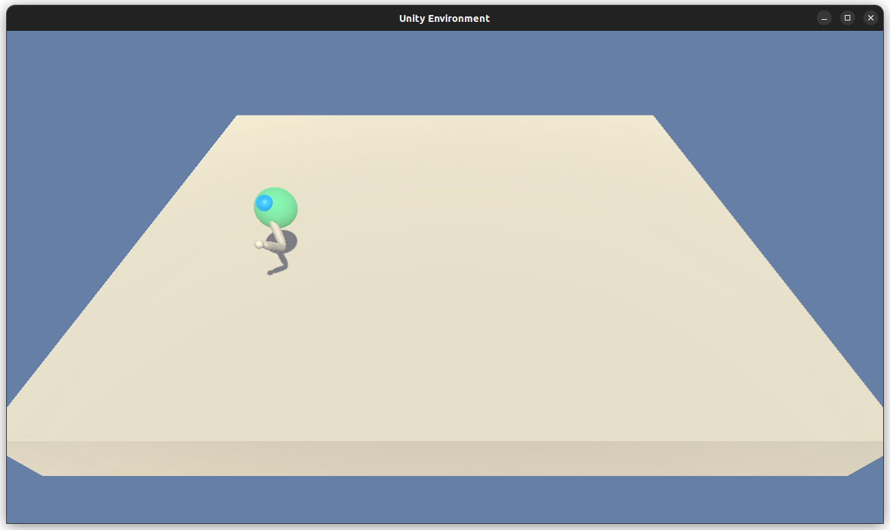

# Controlling the arm
## Introduction

Reinforcement Learning has a wide variety of algorithms that can help
shape how an agent learns while interacting with an environment. The
goal is to find a way to efficiently teach an agent how to get the
best reward (outcome?) while interacting with an environment.

This image, from [OpenAI Spinning Up](https://spinningup.openai.com/en/latest/spinningup/rl_intro2.html),
shows some of the most important algorithms.


Depending on the nature of the observation and action spaces some
algorithms can work really good. In these project we are focusing
in an environment with:

- Continuous observation space
- Continuous action space

This leaves us with a more limited set of algorithms that can be applied.
One particular that is missed is DQN, which can handle continuous
observation spaces really well, but only if the action space is 
discrete. For this reason, the main focus of algorithms will
be those that mix policy optimization and Q-learning via the use
of two models:

1. An actor model: resembling how DQN works, a model with continuous
output allows to choose for **one** action.
2. A critic model: which resembles the q-learning algorithm, assigns
a value to the state-action pair, allowing to have an estimate,
albeit internal, of how good the action is.

These methods are called actor-critic methods. In this project, 
in particular, the **DDPG** algorithm was chosen.

## Environment

The environment is about teaching a double-jointed arm to stay as 
close as possible to a moving target location:



* Observation space: a 33 dimensional vector
* Action space: a 4 dimensional vector
* Reward: 0.1 for each timestep the agent is within the goal

Each time step the agent must choose an action in a 4 dimensional
space within the range [-1.0, 1.0]. These values represent the
rotation for two joints of the arm.

The environment is considered **solved if the agent manages to get
an average score of 30 over 100 runs**.

## How to run the agent

To run and train the agent that solves the environment a `conda` installation is recommended. 
Installing the dependencies requires the following command:

``` sh
conda env create -f environment.yml
```

This will create a new conda environment named `drlnd` and automatically install
all the required packages within it. Then, run the following commands to activate
the environment and open the Jupyter interface:

```sh
conda activate drlnd
jupyter notebook
```

If a web browser window is not automatically open the output of the command should show a URL
that can be copied and pasted in a web browser. On this interface
select `Continuous_Control.ipynb` to see the results.

Here you can watch the video of the best agent:

[](https://youtu.be/HmAkRJAd8BQ)

## Training the agent

The agent is trained with the help of the `Weights & Biases` interface. For such it uses
the `config-defaults.yaml` file to store the training parameters. To run a training
session just run the following:

``` sh
wandb off
python train.py
```

This will disable synchronization to the server and do a single training session.
