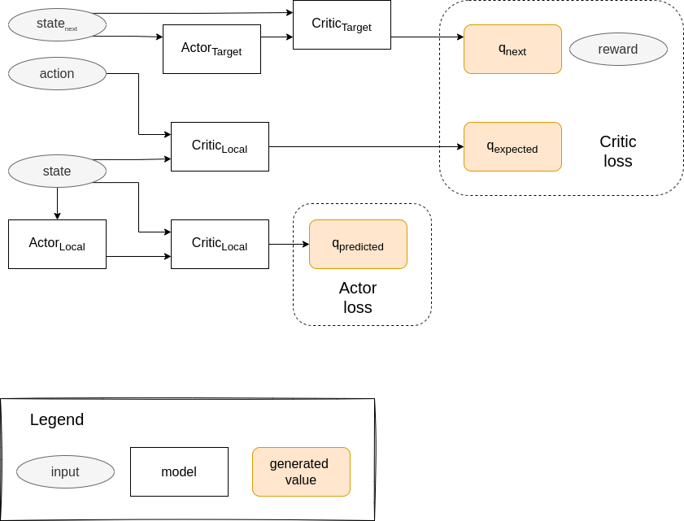

# Solving the Reacher Environment

By: Jorge L. Martínez

## Learning algorithm

DQN is a powerful algorithm for solving environments that have
continuous observation spaces. Nonetheless, it also requires a 
discrete action space to have a chance on converging towards a 
policy that can solve it. When faced with environments with a 
continuous action space it starts to fail.

For these type of environments we require other algorithms to solve
them. One special group of those are the Actor-Critic methods. The 
foundation of these algorithms is that they use two neural networks
that do the following:

- **Actor**: from a state it tries to approximate the best action
- **Critic**: from a state-action pair tries to approximate the value function

For this project, the DDPG (Deep Deterministic Policy Gradient) 
algorithm is used to solve the [Reacher Environment](README.md).
This algorithm is discussed in the paper [Continuous Control with Deep Reinforcement Learning](https://arxiv.org/abs/1509.02971v6), and was
implemented using the resources from Udacity's Deep Reinforcement
Learning nanodegree and [Shangtong Zang's DeepRL](https://github.com/ShangtongZhang/DeepRL) 
repository.

## DDPG Explained

The main idea of the algorithm is summarized in the following diagram:

Starting with the loss, there are two losses that are approximated: 
critic loss and actor loss.

The critic loss is calculated as:

$$ L = \frac{1}{N} \sum_i \left( y_i - Q(s_i,a_i) \right)^2$$

$$ y_i = r_i + \gamma Q' \left(s_{i+1}, \mu'(s_{i+1})  \right) $$

And the actor loss is approximated as:

$$ J \approx \frac{1}{N} \sum_i \nabla_a Q(s,a) \nabla_{\Theta^\mu} \mu (s) $$

This resembles a lot how Q-Learning works except that the action
from the actor network is assumed to be "the best", as getting the
$ argmax $ over a continuous space is harder. The critic helps drive
the maximization of the actor by estimating the actual Q-value of the
interactions.

At each time step the target actor is used to get the next step. Random
noise is added to this value to allow for exploration. The the 
experience is saved in a replay buffer.

Every fixed amount of steps (given by the *learn_every* hyperparameter) the 
agent does a learning step. In this learning step a set of experience
is randomly sampled from the learning buffer and sent through the 
networks as depicted in the diagram above. The local networks' loss
is calculated and a learning step is performed. Finally, the
target networks are updated using a soft-update parameter.

### Replay buffer

Just as in DQN, a replay buffer is used to limit the correlation
between consecutive steps. Each time the agent performs a learning
step it takes a random sample from the replay buffer and uses that 
information.

### Soft update

Also, like in DQN, the target network is slowly updated with the local
network (for both the actor and the critic). This is controlled by the
hyperparameter $ \tau $, and allows to create a soft update according
to the formula:

$$ target = \tau local + (1-\tau)target $$

### Networks

The actor network has as input a state and as output an action. The 
used network was:

The critic network has as input a state and an action, and returs
a single value that represents the Q-value. The used network
was:

## Training

Training was performed using the Unity ML environment for Banana pickup, there are two bananas: blue and yellow. The environment
positively rewards for picking up a yellow banana and negatively rewards for picking a blue banana. 

The hyperparameters that can be tweaked are:
- \# of episodes to train for
- $ \gamma $ : discount factor
- $ \alpha $ : learning rate
- $ \tau $ : Weight softening when copying between target and local networks
- batch_size : How big a sample to take from the memory buffer
- buffer_size : Memory buffer size
- learn_every : How many steps to wait before doing a learning step

Using similar hyperparameters as the ones obtained in the previous
project with DQN [Banana Agent](https://github.com/jorgemb/udacity-deeprl-banana-agent), the following results were obtained:

After around 600 steps the agent managed to get a score > 30. The graph
shows the running average with 100 steps.

This used the following hyperparameter settings:

| Hyperparameter | Value |
| - | - |
| algorithm | DoubleDQN |
| $ \gamma $ | 0.91 |
| $ \alpha $ | 0.0005 |
| $ \tau $ | 0.001 |
| batch_size | 64 |
| buffer_size | 10000 |
| learn_every | 11 |

## Ideas for future work

The first thing to implement is to use the many-agents idea. I chose
to use a single agent to avoid complications while learning the algorithm
but having several agents generating experience from simultaneous 
interaction with different environments could speed learning a lot.

I experienced a faster convergence of this algorithm than the one using
DQN, so I'm not keen on the idea of using prioritized experience replay.
My belief is that because the action space is continuous it is really
hard to assess if an specific action actually was better or worse
than another close action. So it wouldn't help in this case.

The agent used a random process to add noise to each of the action 
being selected. While seeing the final agent working this process
can still be seen as some jitter. Reducing the weight of the random
process (or even training this weight as a hyperparameter) could
help reduce the jitter at the end.

